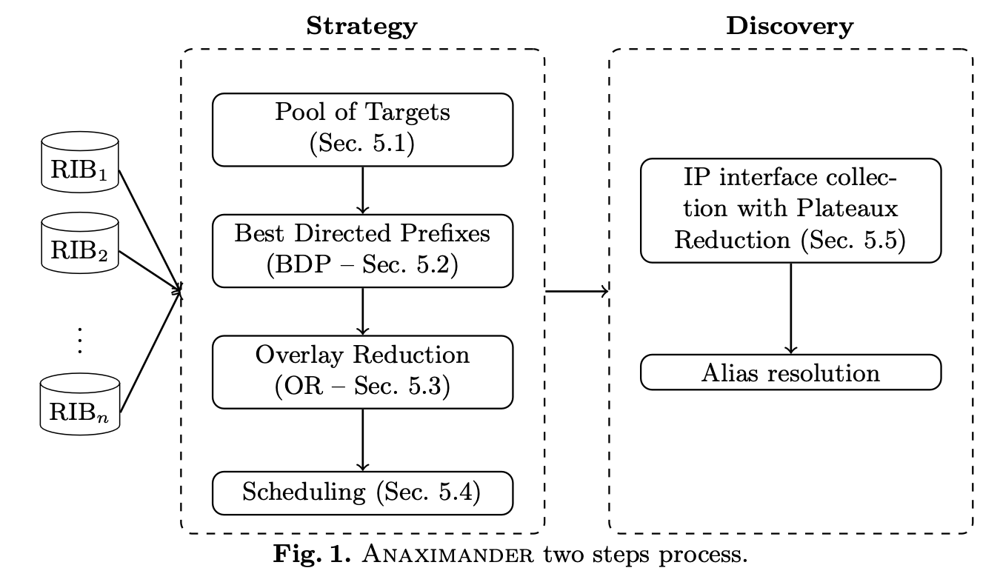

# Anaximander Strategy and Simulator

_Anaximander_ is an ISP probing tool implementing several reduction techniques to cut down the number of probes launched in order to map an Autonomous System, while still keeping high discovery levels.



_Anaximander_ works in two phases: 
1. **Strategy Step**: Run completely offline and with no probing cost, this step produces an initial pool of targets expected to transit the ISP of interest, applies several _reduction techniques_ to reduce the number of probes, and schedules the targets optimally.
2. **Discovery Step**: this step will send probes based on the target list, taking advantage of the ordering of the targets to speed up the discovery progression and possibly stop the probing in some portions when the discovery becomes marginal in said portions.

This project is composed of two parts: 
* The implementation of the **Strategy Step**, to produce the ordered list of targets for probing the ISP of interest.
* The implementation of the **Simulator**, which replicates _Anaximander_'s behavior in a controlled environment to study the impact of the reduction techniques on the final number of probes and the final discovery levels.

## Installation & Dependencies

* _Anaximander_ makes use of BGP information. Go to the [BGPStream's webpage](https://bgpstream.caida.org/docs/tools/bgpreader), to install `bgpreader`, a tool for parsing RIB dumps.
* To parse warts files (CAIDA file format for Traceroutes), _Anaximander_ makes use of [TNT](https://github.com/YvesVanaubel/TNT), an extension to scamper [1] able to reveal MPLS tunnels. In the context of this project, `TNT` is only used as a file parser, not a prober.
* This project is written in the Go language, please refer to [Go installation's webpage](https://golang.org/doc/install) to set up Go on your machine.
* Download and install the _Anaximander_ Simulator with the command:
```
go install github.com/Emeline-1/anaximander_simulator
```

## Necessary Datasets

Many datasets go into _Anaximander_'s process:

* Warts dataset: _Anaximander_'s simulation will be performed on a dataset of Traceroutes, in the warts format.
* `bdrmapit` annotations file: `bdrmapit` is a tool to annotate routers and IP addresses with ISP ownership. As we are interested in mapping specific ISPs (as opposed to the whole Internet), we need a tool to be able to distinguish network equipment from one AS to the other. Please visit [bdrmapit page](https://alexmarder.github.io/bdrmapit/) to get the tool set up.
* An IP2AS mapping file, that can be obtained (for example) from `bdrmapit`. Visit [bdrmapit page](https://alexmarder.github.io/bdrmapit/) to get the necessary datasets.
* AS relationships file and AS customer cone file can be retrieved [here](https://publicdata.caida.org/datasets/as-relationships/serial-1/) from CAIDA. 

## Usage 

### RIB parsing

_Anaximander_ makes use of routing information to collect the _best directed probes_ that are likely to traverse the ISP of interest, as well as some additional information. Before launching the _Strategy_ or the _Simulation_, one has to collect the necessary information from BGP routing tables.

#### Get sound BGP collectors:

```
./anaximander rib_parsing count -o <output_file> -s <start> -e <end>
```

> To get a single RIB from a collector at a given time, we need to specify the time interval for which we want to retrieve the tables (`start` and `end`, timestamp format). Route Views collectors output a RIB every 2 hours whereas RIPE RIS collectors output a RIB every 8 hours (both aligned to midnight). As RIB dumps are not made atomically, we have to specify a window of a few minutes (e.g., 00:00 -> 00:05). 

The output of this command is a file with all available BGP collectors (from RouteViews and RIPE RIS projects) and the number of routing entries found in each of these tables. A BGP collector is considered as **sound** if it has more than 800k entries.

#### Parse the RIBs:

```
./anaximander rib_parsing ribs_multi -a <ases_interest_file> -c <collectors_file> -o <output_dir> -s <start> -e <end> [-h <BGP_heuristic>] [-asrel <as_rel_file>]
```

> where `ases_interest_file` is a file containing the ASNs we are interested in (white-space separated), and where `collectors_file` is a file containing the **sound** BGP collectors (new-line separated). 
> The `BGP_heuristic` argument allows to choose the BGP heuristic decision process for selecting the best route among a set of possible routes. The default heuristic is the the valley-free heuristic (=`1`) and yields the best results. If you use it, you also need to provide the `as_rel_file` argument. The shortest-path heuristic (=`0`) is also available for the sake of comparison.

The output of this command is plural. 
1. For each BGP collector, a series of files containing the necessary information to build the _best directed probes_ initial pool of targets.
2. The file `all_overlays.txt` contains the necessary information to perform the _Overlay Reduction_ on said pool of targets.

#### Build the _best directed probes_:

```
./anaximander rib_parsing build_best_directed_probes -o <output_dir> -a <ases_file> -c <collectors_file> -d <data_dir>
```

> where `data_dir` is the output directory of the previous step.

The output of this command is a file per AS of interest containing the directed probes for that AS, that will serve as _Anaximander_'s initial pool of targets.

***
### Strategy Step
After parsing the RIBs, we have all necessary information (namely, the _best directed probes_, and the information regarding _Overlay Reduction_) to launch _Anaximander_'s **Strategy** step.

Refer to the Necessary Datasets section for further information on the arguments to this command.

```
./anaximander strategy \
  -ases <ases_interest_file> \
  -asrel <as_rel_file> \
  -ppdc <customer_cone_file> \
  -ip2as <ip2as_file> \
  -dp_dir <directed_prefixes_dir> \
  -overlays_file <overlays_file> \
  -s <strategy> \
  -o <output_dir> \
  -warts <warts_dir> \
  -bdr <bdrmapit_file>
  -vps <vps_file> \
> output.txt
```
> where `directed_prefixes_dir` is the directory containing the _best directed probes_ (output directory of the previous step), > where `vp_file` is a file containing the name and the IP address of each VP in our dataset (new-line separated), and where `strategy` is the number representing the probing strategy to be applied. _Anaximander_ will print various statistics that must be redirected to an output file for better clarity.

#### Probing strategies
The _Anaximander Simulator_ implements several probing strategies, from the simplest one to the best performing one. The best performing strategy (the one implemented in _Anaximander_) is the n°20. You are free to have a look at the other strategies available into the code, launch them, and compare them with each other.

#### Strategy Output
The output of the **Strategy** step is, for each AS of interest, an ordered list of targets for probing the ISP of interest, as well as file giving the separation between the ASes. Those two files are necessary to launch _Anaximander_'s **Simulation**.

***
### Simulation

After applying the desired strategy, we have all necessary files to launch _Anaximander_'s simulation.

Refer to the Necessary Datasets section for further information on the arguments to this command.

```
./anaximander simulation \
  -ases <ases_interest_file> \
  -warts <warts_dir> \
  -bdr <bdrmapit_output_file> \
  -strategy <strategy_dir>
  -o <output_simulation_file> \
  -t <plateau_threshold> \
> output.txt
```

> where `plateau_threshold` is the threshold [0,1] to perform the simulation with Plateaux Reduction, and where `strategy_dir` is the directory where to find the strategy for all ASes of interest (output of the **Strategy** step). Like for the **Strategy** step, _Anaximander_ will output some statistics that must be redirected to an output file for better clarity.

#### Simulation Output

The primary output of the simulation is a file per AS of interest (called `sorted_<output_simulation_file>_XX.txt`) giving the results of the simulation.
Each usefull probe (i.e., a probe that hit the AS of interest and discovered something new) is recorded (one by line) with its number and its associated levels of discovery for links, addresses, and routers.

The secondary output contains additional information that can be useful for further analysing or plotting the results.

***
[1] M. LUCKIE, Scamper: a Scalable and Extensible Packet Prober for Active Measurement of the Internet, ACM SIGCOMM Internet Measurement Conference, November 2010. See [https://www.caida.org/tools/measurement/scamper/](https://www.caida.org/tools/measurement/scamper/)

